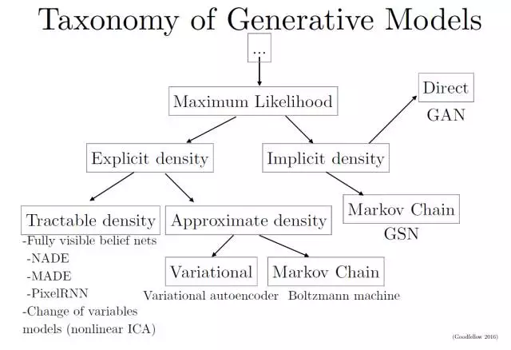
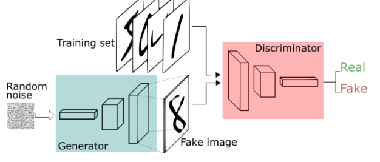
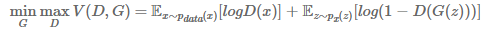
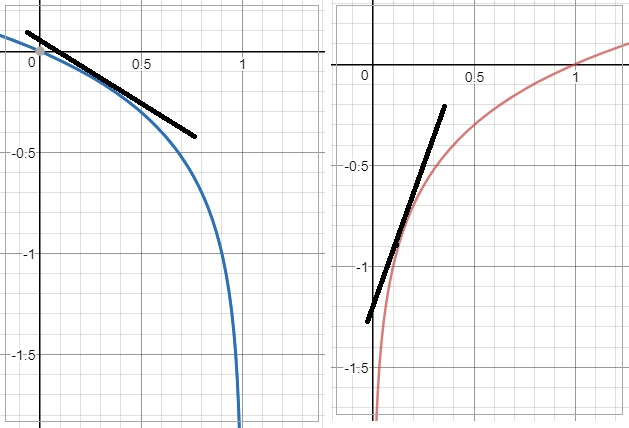
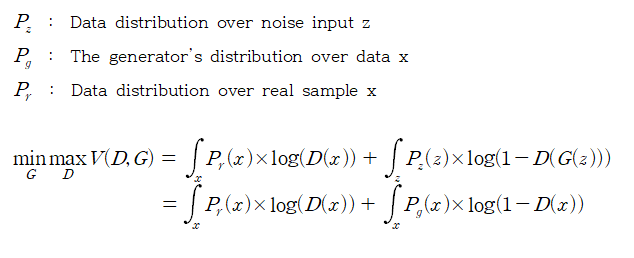
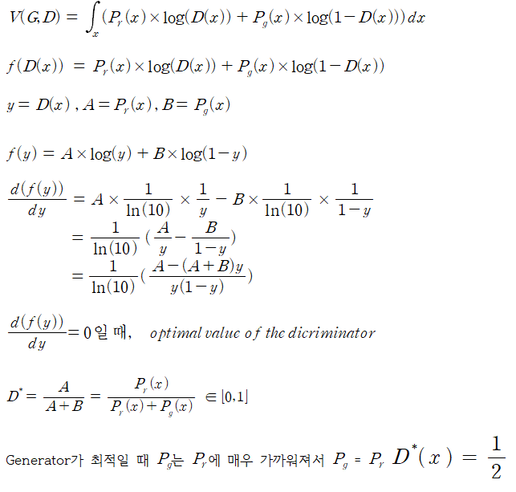
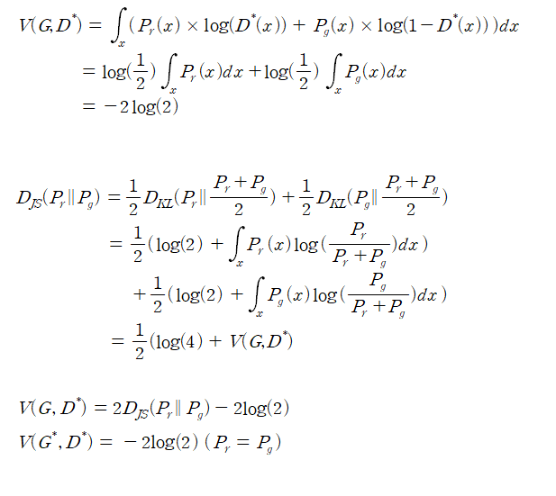

# GAN

GAN generative model 중에서 implicit density에 속하는 방법

GAN은 여러 모델들의  단점을 보완하기 위해 만들어졌다. 본인만의 단점도 있다.
## 1.Explicit density models
명시적으로 분포를 가정하기 때문에 ML이 간단하고 복잡하지않다.
모델을 이용해 likelihood 정의 후 gradient 최적화하면 된다.
하지만 복잡한 데이터에서 계산가능하기 다루기쉬운 모델로 정의하기는 어렵다. 그래서

1.1 tractability를 유지하면서 정의하는법 
1.2 tractable approximation이 가능한 모델을 정의하는법

1.1 fully visible belief network (FVBN)
단점 : 계산 STEP들이  Parallel 하지않아 . (GAN은 parallel해서 속도가 더 빠르다)

1.2.1 VAE
단점 : WEAK Prior distribtuion 이라서 likelihood 사이에 차이는 항상 존재하기 때문에 model과 data 는 달라질수  있다.
(GAN은 Unbiased  하므로 NASH균형을(D와G) 이룬  GAN은 data를 정확히 재현할 수 있다.

1.2.2 Markov chain approximation
단점 : convergence는 매우 느릴 수 있고, converge 했다는 완벽한 보장을 할 수도 없다. 
      High-dimensional한 space에서는 Markov chain이 덜 효과적 (GAN은 Markov chain을 사용하지 않는다)

##2 Implicit density models
Density function이 명시적으로 정의되지 않고도 학습될 수 있도록 디자인
2.1 GSN(generative stochastic network)
단점 : Markov chain은 high dimensional space의 데이터에서 사용이 어렵고 computational cost가 크다

2.2 GAN - 앞에 나온 모델들의 단점을 보완을  할 수 있다.
단점 : NASH균형 (G와 D 사이)이 필요한데, 이것은 objective function을 최적화하는 문제보다 더 어려운 문제

GAN은 adversarial 구조로 image를 생성시키는 Generator와 이를 평가하는 Discriminator로 이루어지고 

이 둘의 관계는 서로 대립적인 구조로 성능을 점차 개선하는 방법이다.

## gan의 장점  
1. High Dimensonal prob distribution을 추출 가능
2. semi-supervised learning에 활용 가능

Generative model(G)는 실제 샘플X의 Distribution을 알아내려고 노력하고 

계속 노력하다보면  data distribution와 똑같은 분포를 만들어 Discriminator(D)가 실제와 가짜를 구별 할 수 없게됩니다.

결국에  D는 실수할 확률을 낮추기 위해서 노력하고(MAX) G는 실제 그림과 차이를 줄여서(MINI) 둘을 동시에 진행하므로  minimax problem 이라고 합니다.

입장을 나누어서 생각하면 D는 구별을 잘하고 상황에서 실제 sample에 대해서는 D(x)=1 이여서 앞부분이 log(1)=0 이 되서 사라지고  
뒷부분에서는 G(z)가 이미지를 만들어낸 것이므로 D(G(z)=0 되도록 구별을 할 것이고 뒷부분도 log(1-0)=0이 되므로 이때가 D입장에서는 최댓값이라고 할 수 있습니다.

반대로 G의 입장에서는 뒷부분에 log(1-D(G(z)) 에서만 영향을 줄 수 있는데, G(z)를 실제 SAMPLE(X)와 같게 하여 x=G(z)가 되게 한다.
그래서 D(G(z))=1 이 되도록해서 log(1-D(G(z))을  최대한 MINIMIZE 시키기 합니다.

하지만 논문에서는 다른 방법으로 G를 설정하는데, 학습이 초기에 진행 될 때 G(z)는 형편없는 이미지를 만들기 때문에 D는 구별을 아주  잘하게 됩니다.
그래서 BACKPROPAGATION을 할 때   log(1-D(G(z))의 Gradient는 아주 작은 값을 가지게 됩니다. 그래서 학습이 느려지게 되는데,
이 부분을 해결하기 위해 log(1-D(G(z))를 minimize하는것보다는 log(D(G(z))를 MAXIMIZE 하는 걸로 바꿔주게 되면 초기에도 강한 Gradient를  줄 수 있습니다.   

## 수식증명

### OPTIMAL D 찾기

### 최적일 때와  JS DIVERGENCE로 바꿔서 표현하기

